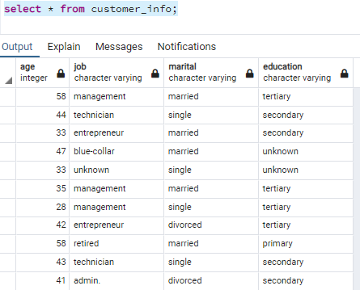
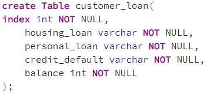
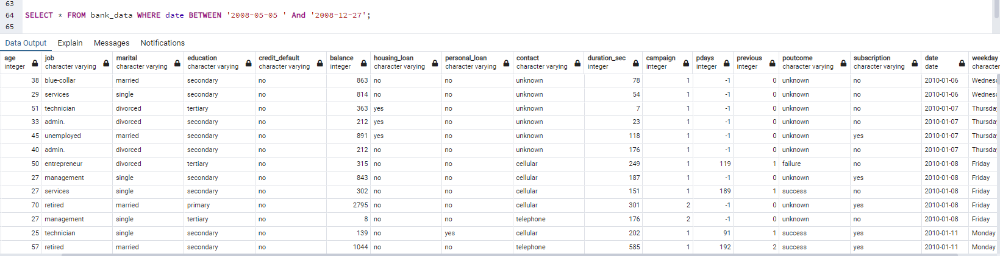
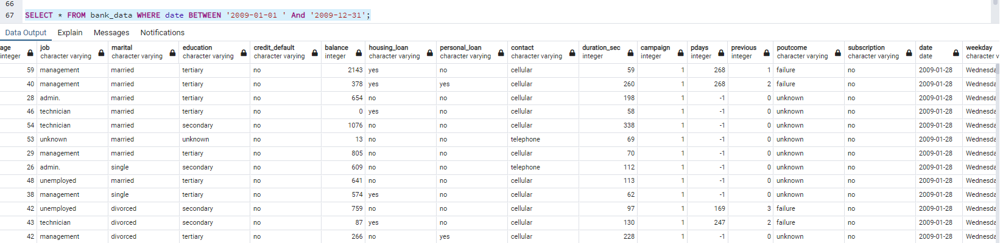
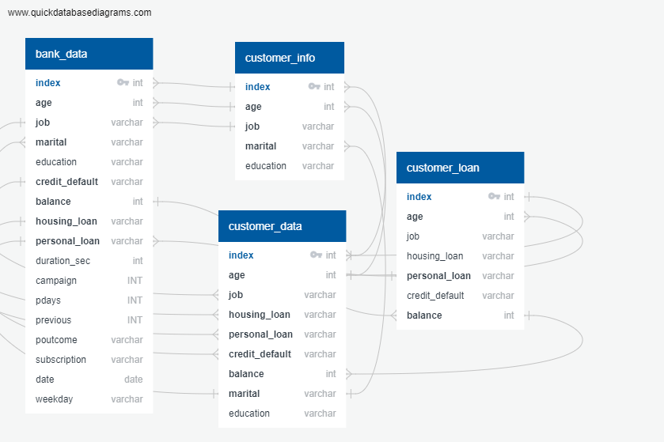

# The Success of Bank Telemarketing

Cleaned data for PGAdmin ready to start creating tables. Removed index row, removed quotations from each row. 

We started by creating bank_data table. With this table created we can start to load the csv file into the table. 

We then created two more tables first being customer personal information and the second being the loan information and the bank account balances. 

Next we devicded to split the data into 3 different csv files and sorted them by each year that the data was collected. 

We created an ERD database to identify our primary key. And also give us an idea what would connect our databses for the inner join table. 

Next we created a table called customer_data. This is where we did the inner join of the data that only pretains to the customer. 

We linked all of our data using amazon RDS. The reason behind using RDS was to make it easier for rest of the team to be able to access all the data tables that were created in the PgAdmin. We have looked at different options but RDS seemd more user friendly and it gave everyone a chance to get more practice with it. 

