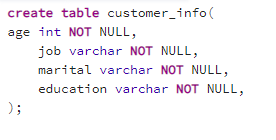

# The Success of Bank Telemarketing

Cleaned data for PGAdmin ready to start creating tables. Removed index row, removed quotations from each row. 

We started by creating bank_data table. With this table created we can start to load the csv file into the table. 

We then created two more tables first being customer personal information and the second being the loan information and the bank account balances. 

Next we devicded to split the data into 3 different csv files and sorted them by each year that the data was collected. 

